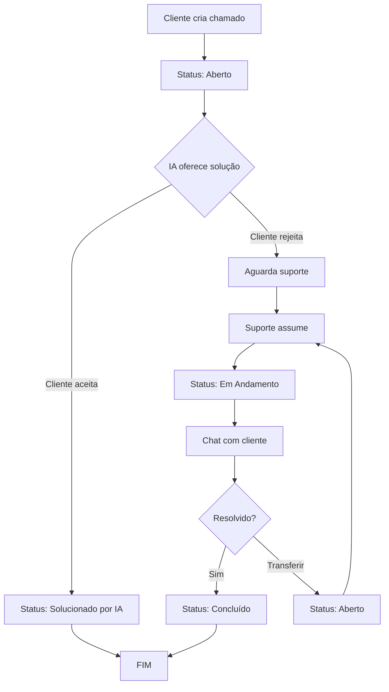

# 📚 Documentação Completa - Sistema Atendix

## 📋 Índice
1. [Visão Geral](#visão-geral)
2. [Arquitetura do Sistema](#arquitetura-do-sistema)
3. [Funcionalidades](#funcionalidades)
4. [Fluxo de Trabalho](#fluxo-de-trabalho)
5. [Regras de Negócio](#regras-de-negócio)
6. [Integrações](#integrações)
7. [Interfaces de Usuário](#interfaces-de-usuário)
8. [Banco de Dados](#banco-de-dados)
9. [Guia de Desenvolvimento](#guia-de-desenvolvimento)
10. [Troubleshooting](#troubleshooting)

---

## 🎯 Visão Geral

**Atendix** é um sistema completo de gestão de chamados de suporte técnico com inteligência artificial integrada. O sistema oferece três níveis de acesso (Cliente, Suporte, Administrador) e utiliza Google Gemini AI para análise automática e sugestão de soluções.

### Tecnologias Utilizadas
- **Backend**: ASP.NET Core 9.0 MVC
- **Frontend**: Razor Pages, Bootstrap 5, jQuery
- **Banco de Dados**: SQL Server com Entity Framework Core
- **IA**: Google Gemini API
- **Autenticação**: ASP.NET Core Identity com Cookies

### Cores do Sistema
- **Principal**: Verde #01acac (marca Atendix)
- **Secundárias**: Azul (info), Amarelo (warning), Verde (success), Vermelho (danger)

---

## 🏗️ Arquitetura do Sistema

### Estrutura de Pastas
```
GestaoChamadosAI_Web/
├── Controllers/
│   ├── AccountController.cs      # Autenticação e autorização
│   ├── ChamadosController.cs     # CRUD de chamados
│   ├── ChatController.cs         # Sistema de mensagens
│   └── HomeController.cs         # Páginas estáticas
├── Data/
│   └── AppDbContext.cs           # Contexto do Entity Framework
├── Models/
│   ├── Chamado.cs                # Modelo de chamado
│   ├── Usuario.cs                # Modelo de usuário
│   ├── MensagemChamado.cs        # Modelo de mensagens
│   └── ErrorViewModel.cs         # Modelo de erros
├── Services/
│   ├── GeminiService.cs          # Integração Google Gemini
│   └── IAService.cs              # Serviço de IA legado
├── Views/
│   ├── Account/                  # Login, registro
│   ├── Chamados/                 # CRUD de chamados
│   ├── Chat/                     # Interface de chat
│   ├── Home/                     # Home page
│   └── Shared/                   # Layouts
│       ├── _Layout.cshtml        # Layout admin/suporte
│       └── _LayoutCliente.cshtml # Layout cliente
├── wwwroot/
│   ├── css/
│   ├── js/
│   └── lib/                      # Bootstrap, jQuery
├── Migrations/                   # Migrações EF Core
├── appsettings.json             # Configurações
└── Program.cs                    # Startup
```

### Padrões de Projeto
- **MVC (Model-View-Controller)**: Separação de responsabilidades
- **Repository Pattern**: Acesso a dados via DbContext
- **Dependency Injection**: Serviços injetados nos controllers
- **Service Layer**: Lógica de negócio isolada (GeminiService, IAService)

---

## ⚙️ Funcionalidades

### 🔐 Sistema de Autenticação

#### Tipos de Usuário
1. **Cliente**
   - Pode criar e visualizar apenas seus próprios chamados
   - Acessa interface simplificada
   - Pode finalizar seus chamados
   - Recebe soluções automáticas da IA

2. **Suporte**
   - Visualiza todos os chamados
   - Pode assumir atendimentos
   - Envia mensagens no chat
   - Pode transferir chamados para outros suportes
   - Finaliza atendimentos

3. **Administrador**
   - Todas as permissões de Suporte
   - Pode editar qualquer chamado
   - Pode assumir atendimentos de outros suportes
   - Acessa modo visualização em chats de outros

#### Fluxo de Login
```
1. Usuário acessa /Account/Login
2. Insere email e senha
3. Sistema valida credenciais
4. Cookie de autenticação é criado
5. Redirecionamento baseado em role:
   - Cliente → /Chamados/Index (layout simplificado)
   - Suporte/Admin → /Chamados/Index (layout completo)
```

---

### 📝 Gestão de Chamados

#### Status Possíveis
| Status | Descrição | Quem Define |
|--------|-----------|-------------|
| **Aberto** | Chamado criado, aguardando atendimento | Sistema (ao criar) |
| **Em Andamento** | Suporte assumiu o atendimento | Suporte/Admin |
| **Concluído** | Chamado finalizado | Cliente OU Suporte |
| **Solucionado por IA** | IA resolveu automaticamente | Sistema (feedback do cliente) |

#### Ciclo de Vida de um Chamado



#### Prioridades
- 🔴 **Alta**: Problemas críticos que impedem trabalho
- 🟡 **Média**: Problemas moderados com workarounds
- 🟢 **Baixa**: Dúvidas, solicitações não urgentes

**Análise Automática**: Google Gemini analisa título e descrição para definir prioridade.

#### Categorias Automáticas (IA)
- Problemas de Acesso
- Problemas de Performance
- Erros Gerais
- Problemas de Impressão
- Problemas de E-mail
- Problemas de Rede
- Instalação de Software
- Backup e Recuperação
- Problemas de Vídeo
- Periféricos
- Outros

---

### 💬 Sistema de Chat

#### Características
- **Tempo Real**: Atualização automática a cada 3 segundos
- **Persistente**: Todas as mensagens salvas no banco
- **Bilateral**: Cliente ↔ Suporte
- **Indicadores**: Lida por Cliente / Lida por Suporte

#### Regras de Acesso
1. **Cliente**: Pode enviar mensagens apenas em seus chamados
2. **Suporte**: Pode enviar apenas em chamados que assumiu
3. **Admin**: Pode visualizar qualquer chat, mas precisa assumir para enviar
4. **Chamados Finalizados**: Ninguém pode enviar mensagens

#### Estrutura de Mensagem
```csharp
public class MensagemChamado
{
    public int Id { get; set; }
    public int ChamadoId { get; set; }
    public int UsuarioId { get; set; }
    public string Mensagem { get; set; }
    public DateTime DataEnvio { get; set; }
    public bool LidaPorCliente { get; set; }
    public bool LidaPorSuporte { get; set; }
}
```

#### Funcionalidades Especiais
- **Assumir Atendimento**: Gera mensagem automática no chat
- **Transferir**: Cria mensagem de sistema informando transferência
- **Finalizar**: Cria mensagem de conclusão

---

### 🤖 Integração com IA (Google Gemini)

#### Serviço: GeminiService.cs

**API Key**: Configurada em `appsettings.json`
```json
{
  "Gemini": {
    "ApiKey": "SUA_API_KEY_AQUI"
  }
}
```

#### Métodos Principais

##### 1. CategorizarChamadoAsync()
```csharp
public async Task<string> CategorizarChamadoAsync(string titulo, string descricao)
```
- **Entrada**: Título e descrição do problema
- **Saída**: Categoria identificada
- **Uso**: Ao criar chamado

##### 2. AnalisarPrioridadeAsync()
```csharp
public async Task<string> AnalisarPrioridadeAsync(string titulo, string descricao)
```
- **Entrada**: Título e descrição
- **Saída**: "Alta", "Média" ou "Baixa"
- **Uso**: Ao criar chamado

##### 3. GerarRespostaAsync()
```csharp
public async Task<string> GerarRespostaAsync(string titulo, string descricao, string categoria)
```
- **Entrada**: Dados do chamado
- **Saída**: Resposta técnica detalhada
- **Uso**: Ao criar chamado (resposta automática)

#### Fluxo de IA ao Criar Chamado
```
1. Cliente preenche formulário
2. Sistema envia para Gemini:
   - Categorização
   - Análise de prioridade  
   - Geração de resposta
3. Chamado salvo com dados da IA
4. Cliente redirecionado para /Chamados/Feedback
5. Cliente avalia se IA resolveu:
   - SIM → Status: "Solucionado por IA"
   - NÃO → Status: "Aberto" (aguarda suporte)
```

---

## 🎨 Interfaces de Usuário

### Layout Cliente (_LayoutCliente.cshtml)

#### Características
- Design minimalista e clean
- Sem sidebar
- Foco na facilidade de uso
- Cards grandes e intuitivos
- Ícones emotivos (⏳, 👤, ✅, 🤖)

#### Componentes
- **Header**: Logo Atendix + Nome do usuário
- **Navegação**: Menu horizontal simples
- **Cards**: Chamados exibidos em cards grandes
- **Botão Principal**: "Abrir Novo Chamado" em destaque

### Layout Suporte/Admin (_Layout.cshtml)

#### Características
- Sidebar com navegação completa
- Dashboard com métricas
- Tabelas responsivas
- Filtros avançados
- Ações em massa

#### Componentes
- **Sidebar**: 
  - Dashboard
  - Chamados
  - (futuro: Relatórios, Configurações)
- **Filtros**:
  - Status (Todos, Abertos, Em Andamento, Concluídos)
  - Responsável (dropdown com suportes)
  - Prioridade (Alta, Média, Baixa)
- **Tabela**:
  - Colunas: Ticket, Título, Cliente, Status, Prioridade, Responsável, Abertura, Ações
  - Botões: Visualizar, Editar (apenas admin)

---

## 📊 Banco de Dados

### Modelo de Dados

#### Tabela: Usuarios
```sql
CREATE TABLE Usuarios (
    Id INT PRIMARY KEY IDENTITY,
    Nome NVARCHAR(200) NOT NULL,
    Email NVARCHAR(200) NOT NULL UNIQUE,
    Senha NVARCHAR(200) NOT NULL,
    Tipo NVARCHAR(50) NOT NULL, -- Cliente, Suporte, Administrador
    DataCriacao DATETIME DEFAULT GETDATE()
)
```

#### Tabela: Chamados
```sql
CREATE TABLE Chamados (
    Id INT PRIMARY KEY IDENTITY,
    Titulo NVARCHAR(200) NOT NULL,
    Descricao NVARCHAR(MAX) NOT NULL,
    DataAbertura DATETIME NOT NULL,
    Status NVARCHAR(50) NOT NULL,
    UsuarioId INT NOT NULL,
    SuporteResponsavelId INT NULL,
    SugestaoIA NVARCHAR(MAX) NULL,
    CategoriaIA NVARCHAR(100) NULL,
    Prioridade NVARCHAR(50) NULL,
    RespostaIA NVARCHAR(MAX) NULL,
    FeedbackResolvido BIT NULL,
    DataFeedback DATETIME NULL,
    FOREIGN KEY (UsuarioId) REFERENCES Usuarios(Id),
    FOREIGN KEY (SuporteResponsavelId) REFERENCES Usuarios(Id)
)
```

#### Tabela: MensagensChamados
```sql
CREATE TABLE MensagensChamados (
    Id INT PRIMARY KEY IDENTITY,
    ChamadoId INT NOT NULL,
    UsuarioId INT NOT NULL,
    Mensagem NVARCHAR(MAX) NOT NULL,
    DataEnvio DATETIME NOT NULL,
    LidaPorCliente BIT DEFAULT 0,
    LidaPorSuporte BIT DEFAULT 0,
    FOREIGN KEY (ChamadoId) REFERENCES Chamados(Id) ON DELETE CASCADE,
    FOREIGN KEY (UsuarioId) REFERENCES Usuarios(Id)
)
```

### Relacionamentos
- **Usuario 1:N Chamados** (como cliente)
- **Usuario 1:N Chamados** (como suporte responsável)
- **Chamado 1:N MensagensChamados**
- **Usuario 1:N MensagensChamados**

---

## 🔧 Regras de Negócio

### Criação de Chamado

#### Validações
- ✅ Cliente pode ter apenas **1 chamado em aberto** por vez
- ✅ Título obrigatório (máx. 200 caracteres)
- ✅ Descrição obrigatória
- ✅ Usuário deve estar autenticado

#### Processo
1. Validar se cliente já tem chamado aberto
2. Criar chamado com status "Aberto"
3. Enviar para Google Gemini:
   - Categorizar problema
   - Analisar prioridade
   - Gerar resposta automática
4. Salvar no banco de dados
5. Redirecionar para página de feedback

### Assumir Atendimento

#### Quem Pode
- ✅ Suporte (sem responsável atribuído)
- ✅ Admin (sempre)

#### Bloqueios
- ❌ Chamados com status "Concluído"
- ❌ Chamados com status "Solucionado por IA"

#### Processo
1. Verificar permissões
2. Verificar status do chamado
3. Atribuir SuporteResponsavelId
4. Mudar status para "Em Andamento"
5. Criar mensagem de sistema no chat
6. Redirecionar para chat

### Transferir Chamado

#### Quem Pode
- ✅ Suporte responsável atual
- ✅ Admin (sempre)

#### Bloqueios
- ❌ Chamados com status "Concluído"
- ❌ Chamados com status "Solucionado por IA"

#### Processo
1. Verificar permissões
2. Verificar status do chamado
3. Atribuir novo SuporteResponsavelId
4. Mudar status para "Aberto" (aguardando novo suporte assumir)
5. Criar mensagem de transferência no chat
6. Redirecionar para detalhes

### Finalizar Atendimento

#### Quem Pode
- ✅ Cliente (seus próprios chamados)
- ✅ Suporte responsável
- ✅ Admin (sempre)

#### Bloqueios
- ❌ Chamados já finalizados

#### Processo
1. Verificar permissões
2. Mudar status para "Concluído"
3. Salvar no banco
4. Cliente: redirecionar para lista
5. Suporte: redirecionar para lista

### Enviar Mensagem no Chat

#### Quem Pode
- ✅ Cliente (em seus chamados abertos/em andamento)
- ✅ Suporte responsável (em chamados assumidos)
- ✅ Admin (após assumir)

#### Bloqueios
- ❌ Chamados com status "Concluído"
- ❌ Chamados com status "Solucionado por IA"
- ❌ Admin em modo visualização (precisa assumir)

#### Processo
1. Validar permissões
2. Validar status do chamado
3. Salvar mensagem no banco
4. Retornar JSON com dados da mensagem
5. JavaScript adiciona mensagem no chat
6. Scroll automático para última mensagem

---

## 📱 Componentes da Interface

### Modal de Loading (Create.cshtml)
```html
<!-- Exibido durante processamento da IA -->
<div class="modal" id="loadingModal">
    <div class="spinner-border"></div>
    <h5>🤖 IA Analisando seu Chamado</h5>
    <div class="progress-bar"></div>
</div>
```

**Ativação**: Ao submeter formulário de criação de chamado

### Cards de Chamados (Index - Cliente)
```html
<div class="card">
    <div class="rounded-circle bg-{status}">
        <i class="bi bi-{icon}"></i>
    </div>
    <div>
        <h6>{titulo}</h6>
        <p>📅 {data}</p>
        <span class="badge">{status}</span>
    </div>
</div>
```

### Tabela de Chamados (Index - Suporte)
```html
<table class="table">
    <thead>
        <tr>
            <th>Ticket</th>
            <th>Título</th>
            <th>Cliente</th>
            <th>Status</th>
            <th>Prioridade</th>
            <th>Responsável</th>
            <th>Abertura</th>
            <th>Ações</th>
        </tr>
    </thead>
    <tbody>
        <!-- Linhas de chamados -->
    </tbody>
</table>
```

### Interface de Chat
```html
<div class="card">
    <div class="card-header">
        Chat do Atendimento
    </div>
    <div class="card-body" id="chatMessages">
        <!-- Mensagens aparecem aqui -->
    </div>
    <div class="card-footer">
        <form id="formEnviarMensagem">
            <textarea></textarea>
            <button>Enviar</button>
        </form>
    </div>
</div>
```

**JavaScript**: Atualização automática a cada 3 segundos via AJAX

---

## 🚀 Guia de Desenvolvimento

### Configuração do Ambiente

#### Pré-requisitos
- Visual Studio 2022 ou VS Code
- .NET 9.0 SDK
- SQL Server (LocalDB ou Express)
- Conta Google Cloud (para Gemini API)

#### Setup Inicial

1. **Clone o repositório**
```bash
git clone <repo-url>
cd GestaoChamadosAI_Web
```

2. **Configure appsettings.json**
```json
{
  "ConnectionStrings": {
    "DefaultConnection": "Server=(localdb)\\mssqllocaldb;Database=GestaoChamadosDB;Trusted_Connection=True;"
  },
  "Gemini": {
    "ApiKey": "SUA_GOOGLE_GEMINI_API_KEY"
  }
}
```

3. **Restaurar pacotes**
```bash
dotnet restore
```

4. **Criar banco de dados**
```bash
dotnet ef database update
```

5. **Executar aplicação**
```bash
dotnet run
```

6. **Acessar**
```
https://localhost:5001
```

### Adicionando Novos Recursos

#### Exemplo: Nova Funcionalidade

**1. Criar Migration**
```bash
dotnet ef migrations add NomeDaMigracao
dotnet ef database update
```

**2. Atualizar Model**
```csharp
// Models/Chamado.cs
public string? NovoCampo { get; set; }
```

**3. Atualizar Controller**
```csharp
// Controllers/ChamadosController.cs
[HttpPost]
public async Task<IActionResult> NovaAcao(int id)
{
    var chamado = await _context.Chamados.FindAsync(id);
    // lógica
    await _context.SaveChangesAsync();
    return RedirectToAction(nameof(Index));
}
```

**4. Atualizar View**
```razor
<!-- Views/Chamados/Index.cshtml -->
<button asp-action="NovaAcao" asp-route-id="@chamado.Id">
    Nova Ação
</button>
```

### Boas Práticas

#### Controllers
- ✅ Use `async`/`await` para operações de banco
- ✅ Valide permissões no início do método
- ✅ Use `TempData` para mensagens de sucesso/erro
- ✅ Retorne `NotFound()` quando recurso não existe
- ✅ Use `[Authorize(Roles = "...")]` para restringir acesso

#### Views
- ✅ Use Razor Tag Helpers (`asp-action`, `asp-route-id`)
- ✅ Valide no cliente com `required`, `maxlength`
- ✅ Use Bootstrap classes para responsividade
- ✅ Separe CSS em `<style>` ou arquivos externos
- ✅ Use `@section Scripts` para JavaScript específico

#### JavaScript
- ✅ Use jQuery para AJAX (já incluído)
- ✅ Trate erros com `error` callback
- ✅ Atualize UI dinamicamente sem recarregar página
- ✅ Use `setTimeout`/`setInterval` com cautela

---

## 🐛 Troubleshooting

### Problemas Comuns

#### 1. Erro de Conexão com Banco de Dados
**Erro**: `A network-related or instance-specific error occurred`

**Solução**:
```bash
# Verificar se SQL Server está rodando
# Atualizar connection string em appsettings.json
# Recriar banco de dados
dotnet ef database drop
dotnet ef database update
```

#### 2. Erro de API Key do Gemini
**Erro**: `401 Unauthorized` ou `API key not valid`

**Solução**:
- Verificar se API Key está correta em `appsettings.json`
- Verificar se API está ativada no Google Cloud Console
- Verificar cotas da API

#### 3. Modal de Loading não Aparece
**Causa**: JavaScript não carregou ou erro de sintaxe

**Solução**:
```javascript
// Verificar console do navegador (F12)
// Garantir que Bootstrap está carregado
// Verificar se ID do modal está correto
```

#### 4. Filtros não Funcionam
**Causa**: Parâmetros de query string incorretos

**Solução**:
- Verificar se `asp-route-status` tem valor correto
- Verificar se controller recebe parâmetros com nomes corretos
- Usar F12 Network para ver requisição

#### 5. Chat não Atualiza
**Causa**: JavaScript de polling parou ou erro no endpoint

**Solução**:
```javascript
// Verificar console do navegador
// Verificar se setInterval está ativo
// Testar endpoint /Chat/BuscarNovasMensagens manualmente
```

### Logs e Debugging

#### Habilitar Logs Detalhados
```json
// appsettings.Development.json
{
  "Logging": {
    "LogLevel": {
      "Default": "Debug",
      "Microsoft": "Debug",
      "Microsoft.Hosting.Lifetime": "Information"
    }
  }
}
```

#### Ver SQL Gerado pelo EF Core
```csharp
// Program.cs
builder.Services.AddDbContext<AppDbContext>(options =>
    options.UseSqlServer(connectionString)
           .EnableSensitiveDataLogging()
           .LogTo(Console.WriteLine));
```

---

## 📈 Melhorias Futuras

### Backlog de Funcionalidades

#### Curto Prazo
- [ ] Dashboard com gráficos (chamados por dia, status, prioridade)
- [ ] Notificações em tempo real (SignalR)
- [ ] Upload de anexos (imagens, arquivos)
- [ ] Sistema de avaliação (rating) do atendimento
- [ ] Histórico de alterações do chamado

#### Médio Prazo
- [ ] Relatórios exportáveis (PDF, Excel)
- [ ] SLA (tempo de resposta/resolução)
- [ ] Cadastro de perguntas frequentes (FAQ)
- [ ] Base de conhecimento
- [ ] Integração com e-mail (notificações)

#### Longo Prazo
- [ ] App mobile (React Native, Flutter)
- [ ] API REST para integrações externas
- [ ] Chatbot avançado com Gemini
- [ ] Análise de sentimento nas mensagens
- [ ] Machine Learning para prever tempo de resolução

### Otimizações Técnicas

#### Performance
- [ ] Cache de consultas frequentes (Redis)
- [ ] Lazy loading de relacionamentos
- [ ] Paginação em todas as listas
- [ ] CDN para assets estáticos
- [ ] Minificação de JS/CSS

#### Segurança
- [ ] Rate limiting (prevenção DDoS)
- [ ] CSRF tokens em todos os formulários
- [ ] Sanitização de HTML nas mensagens
- [ ] Logs de auditoria (quem fez o quê)
- [ ] 2FA (autenticação em dois fatores)

#### Qualidade de Código
- [ ] Testes unitários (xUnit)
- [ ] Testes de integração
- [ ] Coverage de testes > 80%
- [ ] Análise de código estático (SonarQube)
- [ ] CI/CD (GitHub Actions, Azure DevOps)

---

## 📞 Suporte e Contato

### Documentação Adicional
- [ASP.NET Core Docs](https://docs.microsoft.com/aspnet/core)
- [Entity Framework Core](https://docs.microsoft.com/ef/core)
- [Bootstrap 5](https://getbootstrap.com/docs/5.0)
- [Google Gemini API](https://ai.google.dev/docs)

### Convenções de Código
- **Indentação**: 4 espaços
- **Nomenclatura**: PascalCase para classes, camelCase para variáveis
- **Idioma**: Comentários em português, código em inglês quando possível
- **Git**: Commits descritivos em português

---

## 📝 Changelog

### Versão 1.0.0 (Novembro 2025)
✨ **Novidades**
- Sistema completo de chamados com IA
- Três níveis de usuário (Cliente, Suporte, Admin)
- Chat em tempo real
- Integração Google Gemini
- Layouts otimizados por tipo de usuário
- Sistema de transferência de chamados
- Feedback de soluções automáticas

🐛 **Correções**
- Padronização do status "Concluído"
- Validações de permissões em chamados finalizados
- Encoding UTF-8 em todos os textos
- Filtros de status corrigidos
- Modal de loading ao criar chamado

🎨 **Interface**
- Rebranding para "Atendix"
- Cores verde #01acac
- Layout cliente sem sidebar
- Nomenclatura "Ticket #" em vez de "#id"
- Alinhamento de colunas na tabela
- Ícones Bootstrap Icons

---

**Última atualização**: 05/11/2025
**Versão**: 1.0.0
**Desenvolvido com**: ASP.NET Core 9.0 + Google Gemini AI
